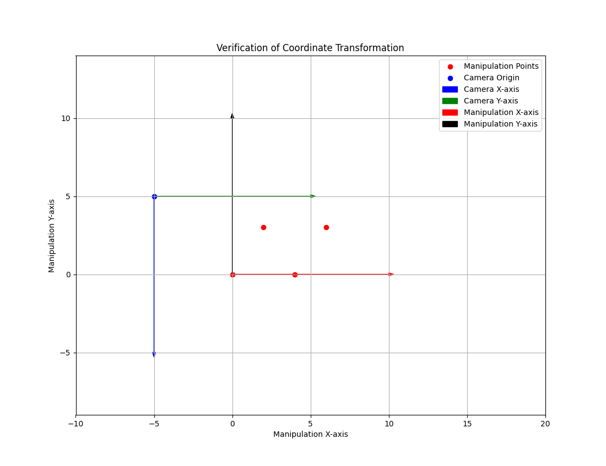

# Vision System for Assembly Machine Calibration

## Project Overview

This project implements a vision system for calibrating the camera and detecting features on assembly components. The system processes stationary images of components to identify waveguide entrances and resonator rings on photonic chips. The identified features are transformed into global coordinates for precise alignment with the manipulation axis, aiding automated assembly processes.

---

## Key Features

- **Camera Calibration**: Aligns the camera's frame of reference with the manipulation system. Computes pixel-to-millimeter scale, rotation angles, and transformation matrices.
- **Feature Detection**: Identifies waveguide entrances and resonator rings. Processes edge detection and ROI extraction and outputs feature positions in JSON format.
- **Visualization**: Displays calibrated axes and detected features for verification.

---

## Dependencies

The following Python libraries are required:

- **OpenCV**: Image processing and visualization.
- **NumPy**: Numerical computations.
- **SymPy**: Symbolic mathematics for solving equations.
- **Matplotlib**: Visualization of transformations and detection results.
- **scikit-learn**: Line fitting using RANSAC.

---

## Setup Instructions

1. Clone the repository:
    ```bash
    git clone https://github.com/gkhanh/EmbeddedVisionSystem-3S.git
    cd EmbeddedVisionSystem-3S
    ```

2. Install dependencies:
    ```bash
    pip install -r requirements.txt
    ```

3. Place input images in the root directory.

4. Run the system:
    ```bash
    python main.py
    ```
   **Note**: The system currently only run in the test files

    ```bash
    # Run this file to test the camera calibration function 
    python test_calibration.py
    
    # Run this file to test the waveguide entrance detection function
    python waveguide_entrance_detection_test.py   
    ```
---

## Input/Output

### Input:
- High-resolution images of photonic chips.
- Pre-defined manipulation coordinates for calibration.

### Output:
- JSON file with coordinates of detected features.
  - Example format:
      ```json
      {
        "manipulation_points": [
          [0, 0],
          [3, 9],
          [3, 8],
          [4, 8]
        ],
        "camera_points": [ 
          [2, 3],
          [3, 2],
          [4, 3]
        ]
      }
    ```
  **Note**: the camera_points dataset is defined with the assembly machine
- A graph display the combined axis map of both manipulation and camera coordinate systems
 (90 degree rotation)
---

## Functional Requirements

- Stationary image processing; no real-time constraints.
- Camera and chip movement are managed externally.
- Assumes a fixed field of view for each image.

---

## Workflow

### 1. Camera Calibration
- Align the camera’s coordinate system with the manipulation axes.
- Compute transformation matrices and scaling factors.

### 2. Feature Detection
- Detect chip edges and extract regions of interest (ROIs).
- Identify waveguide and resonator features.
- Generating the reference plane

### 3. Output
- Provide precise coordinates for integration with the manipulation system.
- provide the calculation for getting the reference plane
---

